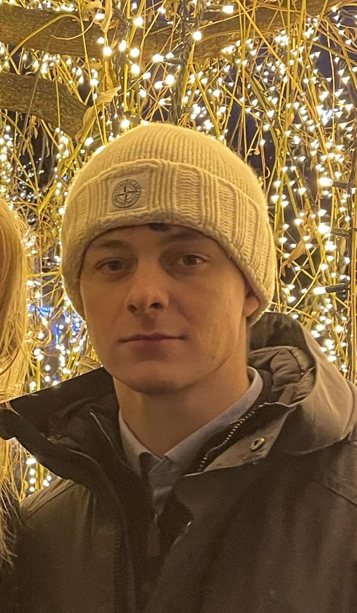

# Oskar Allerslev Christiansen

  
  <!-- Image positioned to the left with proper scaling -->
  
  
  <!-- Personal introduction and content on the right side of the image -->
  

    A collection of my work. Not anything super extensive, but fun little projects.
  

**📍 Location:** Copenhagen  
**✉️ Email:** [Oskar.m1660@gmail.com](mailto:Oskar.m1660@gmail.com)  
**📞 Phone:** +45 20200679  

---

## 🚀 Projects

- 🎓 [**Financial Econometrics Project**](https://rpubs.com/OskarAllerslev/1223102):  
  An in-depth analysis using AR(1) processes for forecasting, demonstrating advanced skills in time series analysis and statistical modeling.

- 🐍 [**Python Assignment - Python Reserving for Finance**](https://github.com/OskarAllerslev/Python-reserve-assignment):  
  A comprehensive university assignment implementing advanced Markov models in Python, showcasing mathematical proficiency and programming skills applied to financial contexts.

- 💻 [**GitHub Repositories**](https://github.com/OskarAllerslev):  
  Explore my GitHub repositories for additional projects and code samples.

- 📊 [**Shiny Cost Project**](https://oskarallerslev.shinyapps.io/project/):  
  An interactive Shiny application designed to visualize and analyze cost data. Used for cost deep dive and cost overview in biotech company.

---

## 📝 Professional Summary

I am a highly motivated third-year Bachelor student at the **University of Copenhagen**, specializing in **Actuarial Mathematics**. With a strong foundation in advanced mathematics and statistics, I am passionate about applying mathematical concepts to solve complex financial problems. My eagerness to learn coding and leverage programming languages like Python and R in finance drives me to continually expand my skill set. I excel in quantitative analysis, statistical modeling, and have a keen interest in algorithmic trading and financial econometrics.

---

### 🎓 Education

#### **University of Copenhagen** (2022 - 2025)
**Bachelor’s in Actuarial Mathematics**

- **Coursework Highlights:**
  - **📚 Advanced Mathematics and Analysis:**  
    Deep understanding of Real and Complex Analysis, Linear Algebra, and Numerical Analysis.
  - **📈 Statistical Methods:**  
    Proficient in Statistical Methods, Mathematical Statistics, and Probability with Measure Theory, covering topics like Markov Chains, Martingales, and Stochastic Processes.
  - **💼 Financial and Insurance Studies:**  
    Knowledgeable in Non-life Insurance, Insurance Law, and currently studying Finance and Financial Econometric Time Series Modeling (Graduate Course).

- **📅 Current Courses (Sept - Nov 2024):**
  - **Financial Econometric Time Series Modeling (Graduate Course):**  
    Engaging in advanced time series analysis and econometric modeling.
  - **Regression Analysis:**  
    Applying statistical models to predict and interpret data.
  - **Finance:**  
    Studying financial markets, instruments, and investment strategies.

- **🔮 Upcoming Courses:**
  - **Life Insurance**
  - **Accounting and Law**
  - **Bachelor’s Project**

---

### 🛠️ Personal Projects

#### **Algorithmic Currency Trading** (Current)

- **💰 Fund Management:**  
  Managing a portfolio of **USD 22k** using proprietary algorithms based on game theory and statistical arbitrage.
  
- **📈 High ROI Achievement:**  
  Achieved an average ROI of **23% in 2024** for three clients, outperforming market benchmarks.
  
- **🖥️ Technical Implementation:**  
  Developed advanced Python scripts interfacing with the IBKR API to execute automated trading strategies.

---

### 💼 Work Experience

#### **Bookkeeper / Finance Assistant** (Biotech Startup) *(Jan 2024 - Present)*

- **📊 Financial Analysis:**  
  Conducted internal financial data analysis to support strategic decision-making.
  
- **📈 Budget Modeling:**  
  Applied renewal theory to create accurate and efficient budget models.
  
- **📚 Bookkeeping Responsibilities:**  
  Oversaw financial records and ensured compliance with accounting standards.

#### **Private Mathematics Tutor** *(2023 - June 2024)*

- **👨‍🏫 Personalized Instruction:**  
  Provided one-on-one tutoring in advanced mathematics, helping students achieve academic excellence.
  
- **📝 Curriculum Development:**  
  Created customized lesson plans to address individual learning needs.

#### **Sole Financial Accountant** (Local Political Party) *(2021 - 2022)*

- **📈 Budget Management:**  
  Developed and managed internal budgets for events and initiatives.
  
- **🧾 Financial Reporting:**  
  Prepared and submitted annual financial statements, ensuring transparency and accountability.

#### **Academy for Talented Youths (ATU)** *(2020 - 2022)*

- **📚 Advanced Learning:**  
  Participated in specialized lectures covering a wide range of academic disciplines.
  
- **📄 Research Project:**  
  Produced a comprehensive research paper, demonstrating strong analytical and writing skills.

---

## 🛠️ Skills

- **🌐 Languages:**
  - **Danish** (Native)
  - **English** (Fluent)

- **💻 Technical Proficiencies:**
  - **Programming Languages:**
    - **Python:** Intermediate skills with experience in data analysis and algorithm development.
    - **R:** Intermediate proficiency in statistical computing and graphics.
  - **Software and Tools:**
    - **LaTeX:** Advanced ability to create professional documents and reports.
    - **SAS:** Basic knowledge for statistical analysis.
    - **Excel:** Intermediate expertise in spreadsheet modeling and data visualization.

- **📊 Mathematical and Analytical Skills:**
  - **Advanced Mathematics:** Strong foundation in calculus, linear algebra, and real analysis.
  - **Statistical Modeling:** Proficient in building and interpreting statistical models.
  - **Time Series Analysis:** Experienced in analyzing and forecasting time series data.
  - **Financial Econometrics:** Skilled in applying econometric techniques to financial data.
  - **Actuarial Science:** Knowledgeable in insurance mathematics and risk assessment.

---

## 🌟 Additional Information

- **📚 Eager Learner:**  
  Constantly expanding my knowledge in finance, coding, and quantitative methods.
  
- **🧠 Innovative Problem Solver:**  
  Enjoy tackling complex challenges with creative and effective solutions.
  
- **🤝 Collaborative Team Player:**  
  Value teamwork and actively contribute to group success.

---

## 📬 Contact Me

I'm enthusiastic about connecting with professionals and organizations interested in finance, actuarial science, data analysis, and algorithmic trading. Feel free to reach out for collaboration, opportunities, or discussions.

**✉️ Email:** [Oskar.m1660@gmail.com](mailto:Oskar.m1660@gmail.com)  
**📞 Phone:** +45 20200679  
**🔗 GitHub:** [github.com/OskarAllerslev](https://github.com/OskarAllerslev)

---
