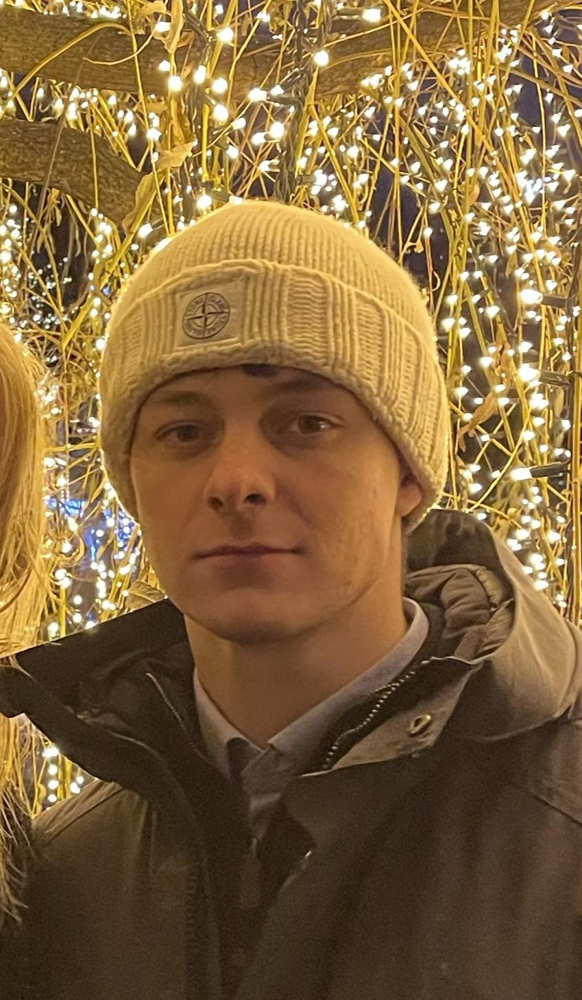

# Oskar Allerslev Christiansen

  
  <!-- Image positioned to the left with proper scaling -->
  
  
  <!-- Personal introduction and content on the right side of the image -->
  

    A collection of my work. Not anything super crazy since this is just something i do for fun. 
  

**📍 Location:** Copenhagen  
**✉️ Email:** [Oskar.m1660@gmail.com](mailto:Oskar.m1660@gmail.com)  
**📞 Phone:** +45 20200679  

---

## 🚀 Projects (Click us)

- 🎓 [**Financial Econometrics Project**](https://rpubs.com/OskarAllerslev/1223102):  
  An in-depth analysis using AR(1) processes for forecasting, demonstrating advanced skills in time series analysis and statistical modeling.

- 📊 [**R package for life insurance calculations**](https://github.com/OskarAllerslev/lifepack):  
  My R package, maintained on CRAN, for calculating product integrals, usefull for finding transitional probabilities given an intensity matrix.
  Further it can caluclate equivalence premiums etc. one fucntion has c++ backend. 

- **📂 [Learning Platform (CL Repo)](https://github.com/OskarAllerslev/CL)**:  
  An e-learning site in development, offering a gamified approach to classic theoretical concepts taught in gymnasiums. Demonstrates front-end and back-end integration and collaborative project work.

- **📝 Other GitHub Repositories** (see [github.com/OskarAllerslev](https://github.com/OskarAllerslev) for more):  
  - Exploring time series and stochastic processes  
  - Testing data structures and fundamentals in **C++** (beginning interest)  
  - Additional financial modeling and quantitative finance experiments

---

## 📝 Professional Summary

I am a highly motivated third-year Bachelor student at the **University of Copenhagen**, specializing in **Actuarial Mathematics**. With a strong foundation in advanced mathematics, statistics, and growing programming expertise, I am passionate about applying quantitative methods to solve complex financial and actuarial challenges. My interest in **quant finance, risk management, and algorithmic trading** drives me to continually expand my skill set. Currently honing my capabilities in **Python**, **R**, and **C++**, I aim to integrate these languages into cutting-edge financial modeling and risk strategies.

I am actively seeking **2025 Summer Internship** opportunities where I can leverage and further develop my **quantitative analysis**, **statistical modeling**, and **time series forecasting** skills in a dynamic environment.

---

### 🎓 Education

#### **University of Copenhagen** (2022 - 2025)
**Bachelor’s in Actuarial Mathematics**

- **Coursework Highlights:**
  - **📚 Advanced Mathematics and Analysis:**  
    Real and Complex Analysis, Linear Algebra, Numerical Analysis.
  - **📈 Statistical Methods:**  
    Mathematical Statistics, Probability with Measure Theory (Markov Chains, Martingales, Stochastic Processes).
  - **💼 Financial and Insurance Studies:**  
    Non-life Insurance, Insurance Law, Finance, and Financial Econometric Time Series Modeling (Graduate Course).

- **📅 Current Courses (Feb - Jun 2025):**
  - **Bachelor's Project**  
    Application of insurance theory in both damage and life insurance.
  - **Accounting and Law**  
    Accounting theory and insurance law.

- **🔮 Upcoming Courses (Fall 2025):**
  - **Interpretable Machine Learning**  
  - **Bachelor’s Project** (continued focus on quant aspects)

---

### 🛠️ Personal Projects

#### **Markov Switching Model**
- **📈 MSM model script** that can be run daily to calculate the current smoothed marginal transition probability in a two-regime model for algorithmic trading.  
- **Automated Trading** via Alpaca (Broker) integration for real-time signal processing.

#### **E-Learning Platform (CL Repo)**
- **🖥️ Partly developed** an e-learning website (with collaboration from Hugo Hendil), featuring gamification of classic theory taught in gymnasiums.  

---

### 💼 Work Experience

#### **Student Worker, Actuary Team at PFA Pension** *(Dec 2024 - Present)*
- **💻 Coding & Automation**: Assisting in the development and maintenance of Shiny dashboards for advanced client reporting, integrating robust data structures and code optimization.  
- **🔎 Quantitative Insight**: Collaborating on actuarial analysis, leveraging statistics and modeling to assess insurance risks and product strategies.

#### **Bookkeeper / Finance Assistant** (Biotech Startup) *(Jan 2024 - Jan 2025)*
- **📊 Financial Analysis**: Supported decision-making via internal data analysis.  
- **📈 Budget Modeling**: Employed renewal theory in creating more accurate budget models.  
- **📚 Bookkeeping**: Ensured compliance with accounting standards and managed financial records.

#### **Private Mathematics Tutor** *(2023 - June 2024)*
- **👨‍🏫 Personalized Instruction**: Provided one-on-one tutoring in advanced mathematics.  
- **📝 Curriculum Development**: Tailored lesson plans for individual learners.

#### **Sole Financial Accountant** (Local Political Party) *(2021 - 2022)*
- **📈 Budget Management**: Developed and monitored budgets for events and initiatives.  
- **🧾 Financial Reporting**: Prepared annual financial statements for transparent operations.

#### **Academy for Talented Youths (ATU)** *(2020 - 2022)*
- **📚 Advanced Learning**: Attended specialized lectures spanning multiple disciplines.  
- **📄 Research Project**: Produced a thorough research paper, honing analytical and written communication skills.

---

## 🛠️ Skills

- **🌐 Languages:**
  - **Danish** (Native)
  - **English** (Fluent)

- **💻 Technical Proficiencies:**
  - **Programming Languages:**
    - **Python:** Intermediate (time series, Markov models, data analysis)
    - **R:** Intermediate (statistical computing, Shiny dashboards)
    - **C++:** Beginner (learning data structures, performance optimization)
  - **Software and Tools:**
    - **LaTeX:** Advanced (professional reporting, academic papers)
    - **SAS:** Basic (statistical analysis)
    - **Excel:** Intermediate (spreadsheet modeling, data visualization)

- **📊 Mathematical and Analytical Skills:**
  - **Advanced Mathematics:** Real/Complex Analysis, Linear Algebra, Calculus
  - **Statistical Modeling:** Regression, hypothesis testing, Markov processes
  - **Time Series Analysis:** Forecasting, AR(1), ARIMA, Markov switching
  - **Financial Econometrics:** Application of econometric methods in finance
  - **Actuarial Science:** Insurance mathematics, risk assessment

---

## 🌟 Additional Information

- **📚 Lifelong Learner**: Continuously expanding knowledge in finance, coding, and advanced quantitative methods.  
- **🧠 Problem Solver**: Excited by novel solutions to complex challenges.  
- **🤝 Team Player**: Fosters collaborative environments for optimal group outcomes.  

---

## 📬 Contact Me

I’m deeply interested in quantitative finance, actuarial analytics, and risk management. I’m particularly looking forward to **2025 Summer Internship** opportunities at **Verition Fund Management** (or similar institutions) to apply and refine my quant skills in a dynamic, hedge-fund environment. Let’s connect!

**✉️ Email:** [Oskar.m1660@gmail.com](mailto:Oskar.m1660@gmail.com)  
**📞 Phone:** +45 20200679  
**🔗 GitHub:** [github.com/OskarAllerslev](https://github.com/OskarAllerslev)
